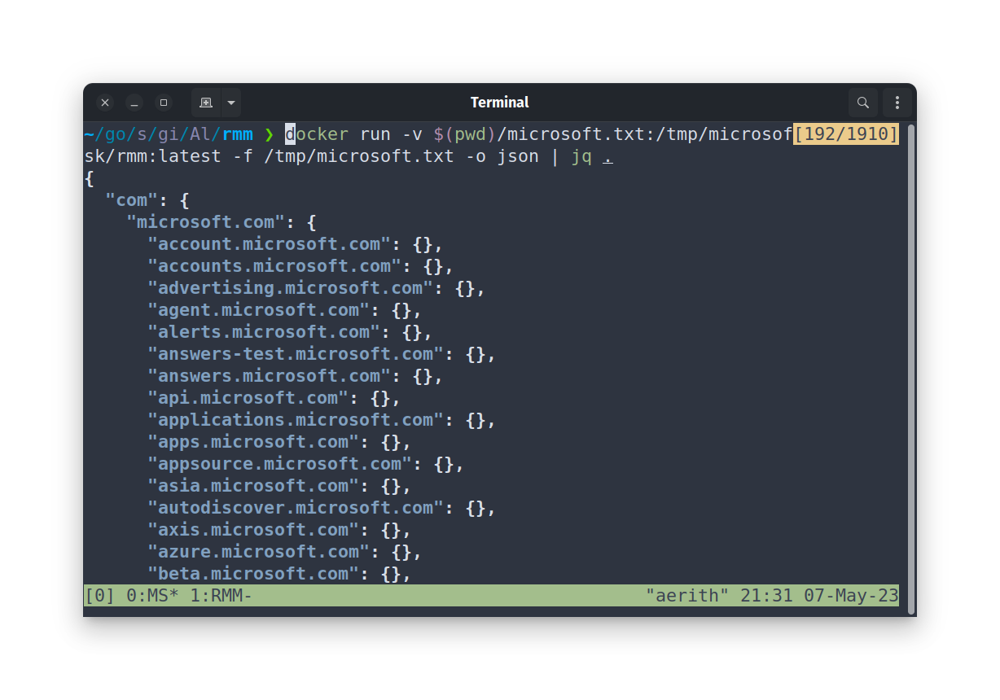

# Recon MindMap (RMM)

Taking inspiration from the `TBHM v4 recon edition by Jason Haddix` Workshop, I developed a command-line interface (CLI) tool that will simplify the task of organizing a list of domains and subdomains. The aim is to create a tool that can easily generate complex domain structures using mind mapping software such as [Obsidian Mind Map](https://github.com/lynchjames/obsidian-mind-map) or [xmind](https://xmind.app/).

## Table of Contents

- [Installation](#installation)
- [Usage](#usage)
- [Contributing](#contributing)
- [Code of Conduct](#code-of-conduct)
- [Contact Information](#contact-information)
- [Donating](#donating)

## Installation

### Build from source

```bash
make
Building Recon MindMap (RMM) binary to './rmm'
cp ./rmm /usr/bin/rmm
```

### Build docker container

```bash
make docker
```

## Usage

### Run locally

```bash
./rmm
Usage:
    rmm [options] <command>

Commands:
    server                   Start a RMM server (TODO).
    update                   Update RMM binary (TODO).

Options:
    -f, --file               Filename from where to read input.
    -h, --help               Print command line options.
    -v, --version            Print version information.
    -o, --output             Display result in different formats list|markdown|json|yaml (default: list)
```

### Run inside docker

```bash
docker run alevsk/rmm:latest -h                                                                        18:34:54
Usage:
    rmm [options] <command>

Commands:
    server                   Start a RMM server (TODO).
    update                   Update RMM binary (TODO).

Options:
    -f, --file               Filename from where to read input.
    -h, --help               Print command line options.
    -v, --version            Print version information.
    -o, --output             Display result in different formats list|markdown|json|yaml (default: list)
```

### Examples

#### Xmind

Provide a list of domains directly to `RMM` and copy the result directly into your clipboard.

```bash
curl https://raw.githubusercontent.com/JamieFarrelly/Popular-Site-Subdomains/master/Microsoft.com.txt | ./rmm |
pbcopy
```

Open Xmind and paste the result directly into the mind map tool.


#### Obsidian Mind Map

Provide a list of domains directly to `RMM`, Obsidian requires the content to be in `MarkDown` format for it to render (pass the `-o markdown` flag), and copy the result directly into your clipboard.

```bash
curl https://raw.githubusercontent.com/JamieFarrelly/Popular-Site-Subdomains/master/Microsoft.com.txt | ./rmm -o markdown | pbcopy
```


#### Run inside docker

```bash
docker run -v $(pwd)/microsoft.txt:/tmp/microsoft.txt alevsk/rmm:latest -f /tmp/microsoft.txt -o json | jq .
```



## Contributing

We welcome contributions to RMM! To contribute, please follow these guidelines:

1. Fork the repository and create a new branch.
2. Make your changes and submit a pull request.
3. Ensure that your code adheres to our code style guidelines.
4. Write tests for any new functionality you add.

## Code of Conduct

We expect all contributors to follow our code of conduct. Please read the [CODE_OF_CONDUCT.md](CODE_OF_CONDUCT.md) file for more information.

## Contact Information

If you have any questions or comments about RMM, please contact me at [@alevsk](https://twitter.com/alevsk).

## Donating

This software is provided free of charge. If you would like to donate something to me, you can via [PayPal](https://paypal.com/paypalme/4levsk). Thank you!
